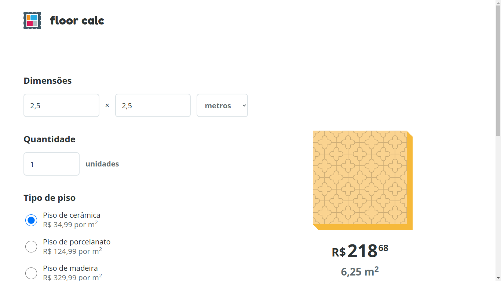
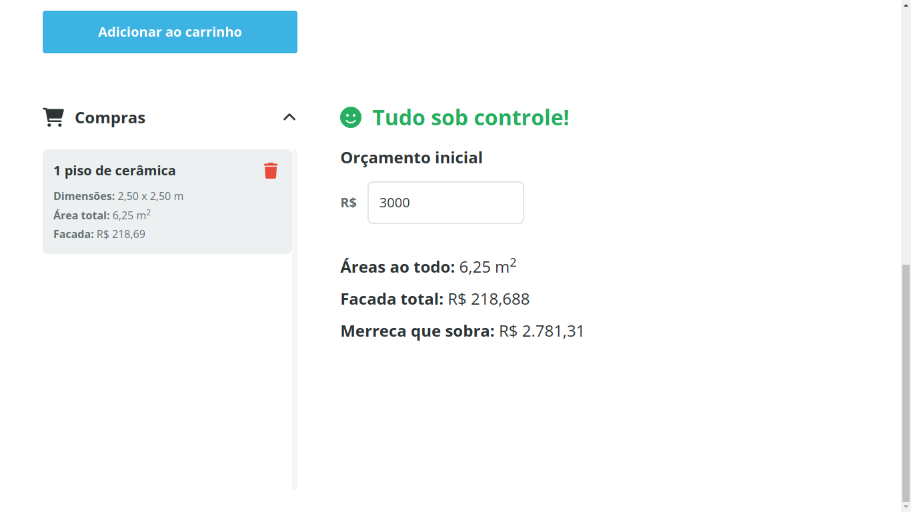
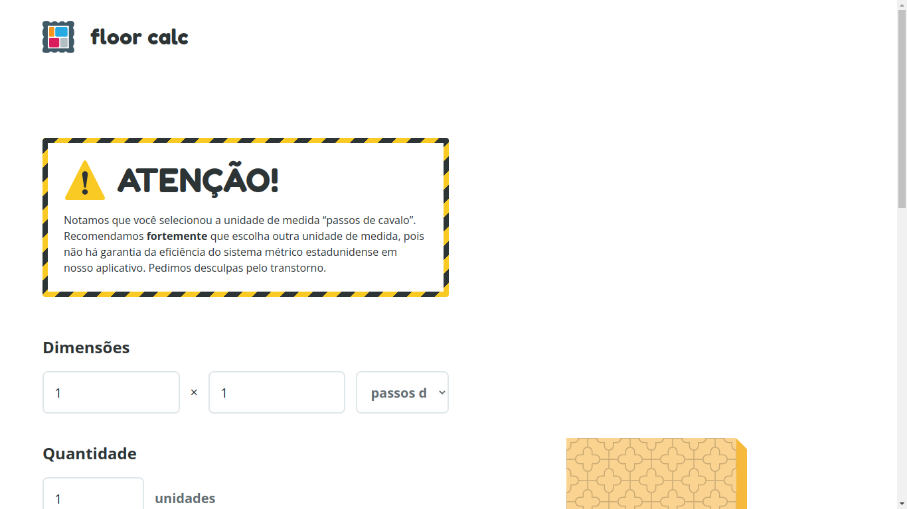

# floor-calc

## Sumário

- [floor-calc](#floor-calc)
  - [Sumário](#sumário)
  - [Motivação](#motivação)
  - [Pilha de tecnologia](#pilha-de-tecnologia)
  - [Galeria](#galeria)
  - [Como rodar](#como-rodar)
    - [Pré-requisitos](#pré-requisitos)
    - [Passo a passo](#passo-a-passo)

## Motivação

Este app consiste em um sistema de uma loja de materiais de construção; no entanto, o único material de construção da loja é piso. O usuário deve escolher entre os três tipos de piso abaixo, além dos valores de comprimento e largura e a quantidade de pisos com tais valores a ser adquirida. Os pisos adquiridos são salvos no carrinho, feito com armazenamento local. O app percorre o carrinho e calcula o valor total (R$) e a área total (m<sup>2</sup>) dos pisos adquiridos pelo usuário. Além disso, o app também exige do usuário um orçamento e informa se o carrinho excedeu o orçamento.

| Tipo de piso | Valor (o m<sup>2</sup>) |
|-|-|
| Cerâmica | R$ 35,00 |
| Porcelanato | R$ 125,00 |
| Madeira | R$ 330,00 |

Este foi o primeiro repositório de código apresentado no [Curso Superior de TSI do IFMS](https://www.ifms.edu.br/campi/campus-aquidauana/cursos/graduacao/sistemas-para-internet/sistemas-para-internet) como requisito para obtenção da nota parcial das atividades da unidade curricular Construção de Páginas Web II.

## Pilha de tecnologia

As seguintes tecnologias foram utilizadas para desenvolver este app:

| Papel | Tecnologia |
|-|-|
| Ambiente de execução | [Node](https://nodejs.org/en/) |
| Linguagem de programação | [JavaScript](https://developer.mozilla.org/pt-BR/docs/Web/JavaScript) |
| Ambiente de desenvolvimento | [Vite](https://vitejs.dev/) |
| [Prototipagem](https://figma.fun/C1bSRZ) | [Figma](https://figma.com/) |

Os créditos pelas mídias utilizadas estão disponíveis [aqui](./assets/README.md).

## Galeria






## Como rodar

### Pré-requisitos

- [Node](https://nodejs.org/en/download/);
- [Yarn](https://yarnpkg.com/) (opcional).

### Passo a passo

1. Clone o repositório de código em sua máquina;
   
2. Abra um shell de comando de sua preferência (prompt de comando, PowerShell, terminal _etc_.);

3. Instale as dependências do projeto através do seguinte comando:

```console
$ npm install
```

Caso esteja utilizando o gerenciador de pacotes Yarn, execute o seguinte comando como alternativa:

```console
$ yarn
```

4. Finalmente, execute o seguinte comando para iniciar o app:

Para npm:

```console
$ npm run dev
```

Para Yarn:

```console
$ yarn dev
```